# The Analysis and Potential Solutions to the Canadian Housing Market

The Canadian Housing market has gone through some turmoil. In this project we are going to analyze how much housing prices have increased over time and the relation of housing prices to a few key factors. We will assess data on housing prices in comparison to the housing affordability index, and then talk about how mortgages have an impact on the housing market. We are then going to talk about the relation to the rental market to the housing market within Canada, comparing if it is worth it for Canadians to buy or rent within the said market and in what geographic areas. Then we will assess some of the solutions to the housing crisis in Canada through PropTech investments and new developments within the country, analyzing solutions to a growing problem that Canadians face!

## Are We In a Housing Crisis?

The question of a possible housing crisis is something that many are speculating due to certain economic indicators pointing towards it. Looking at the data from the charts above, we can see that housing prices, inflation rates and interest rates have all taken a sudden uptrend due to COVID-19. This data indicates that we may be experiencing a housing crisis because rising housing prices will cause higher demand due to housing becoming significantly less affordable. To combat this, interest rates have risen quite drastically recently to counter this, however, this may have a net negative affect since it is becoming much more expensive to get a mortgage.

The housing market is affected by a wide range of factors. As the population rises, so does the need for homes, and as a result, housing prices. The primary driver of increased housing demand is the pressing necessity of home ownership. The housing market is highly sensitive to changes in interest rates. Interest rates can drastically impact a homebuyer's abilities. Lower interest rates make it cheaper to get a mortgage to buy a property, which increases demand for real estate and raises prices. Inflation typically causes home prices to follow the same pattern as those of other 'products. As inflation rises, house prices slow. As shown, interest rate and inflation affect house prices more than population.

## Is there an Impact on Housing from Population Growth and Immigration?

This chart comparing population growth to the number of immigrants coming to Canada from 2005-2022 indicates that there has been a surplus of immigration in canada since the beginning of 2020. As more immigrants move to Canada,  they will need places to live which may lead to higher demands for housing and increased housing prices.

## The Analysis of the Canadian Housing Crisis

## What is the Correlation of the Above Factors to Housing?

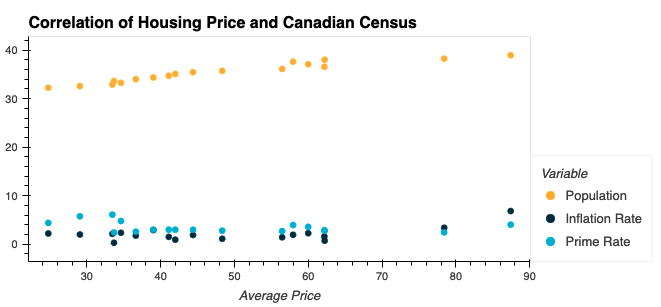 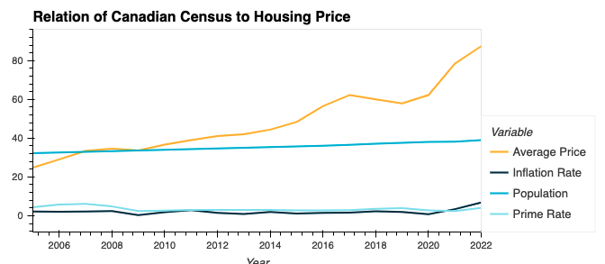

The housing market is affected by a wide range of factors. As the population rises, so does the need for homes, and as a result, housing prices. The primary driver of increased housing demand is the pressing necessity of home ownership. The housing market is highly sensitive to changes in interest rates. Interest rates can drastically impact a homebuyer's abilities. Lower interest rates make it cheaper to get a mortgage to buy a property, which increases demand for real estate and raises prices. Inflation typically causes home prices to follow the same pattern as those of other 'products. As inflation rises, house prices slow. As shown, interest rate and inflation affect house prices more than population.

## How Unaffordable has the Housing Market Become?

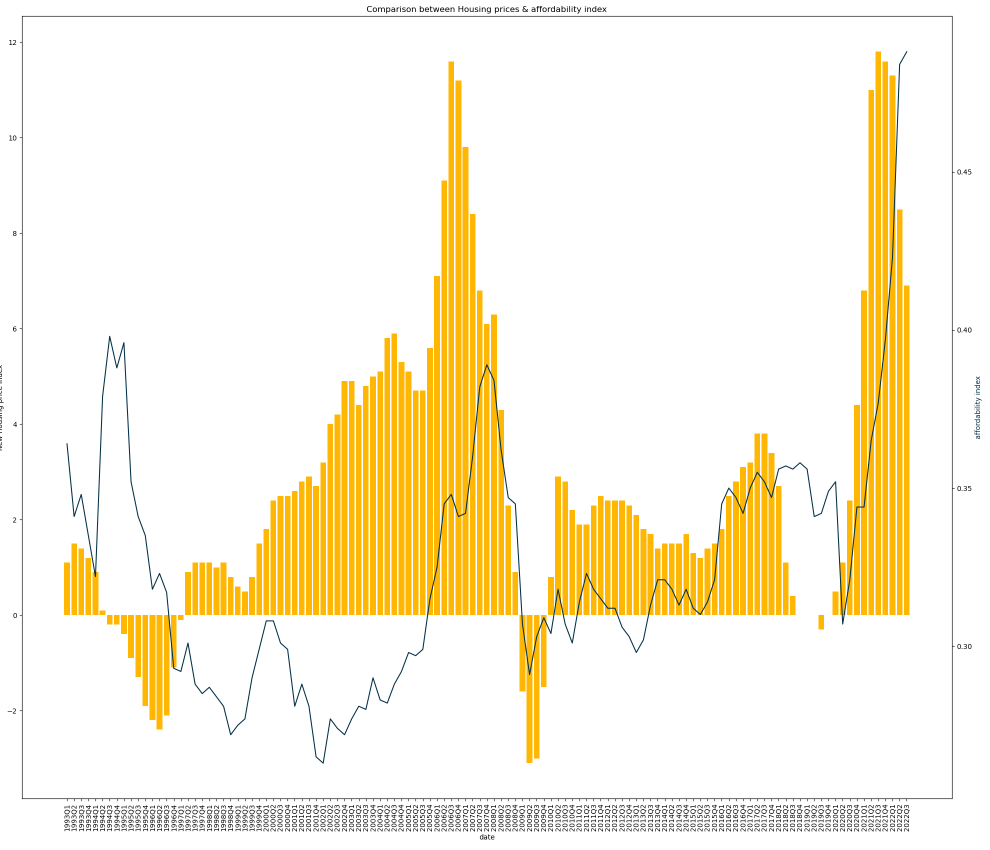

This graph compares the new house price index with affordability index for the Canadian Housing market. The timeline is from 1993 to 2022. And the conclusion that can be drawn here is, although affordability index has increased in recent years, the new house price index has gone up at a much high rate in comparison. (Source - Bank of Canada)

## How do Mortgage-Backed Securities Play a Role in Housing Prices?

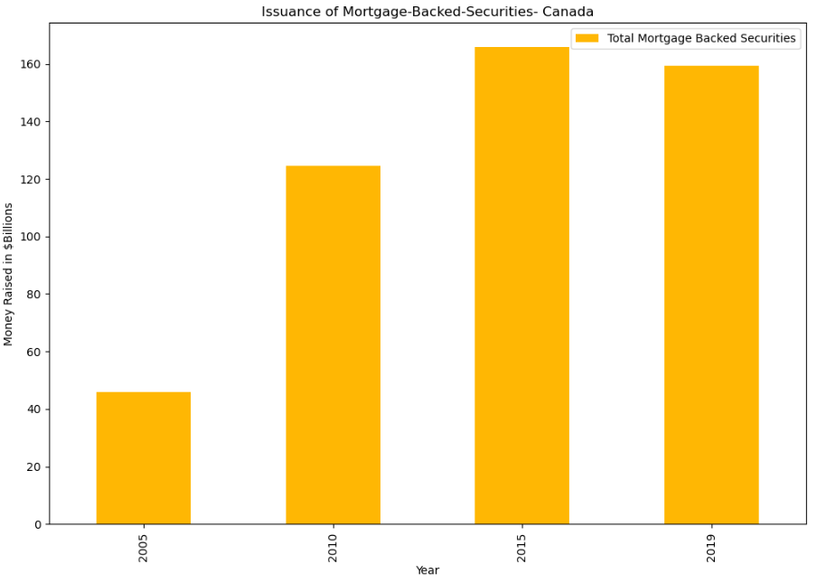

This bar chart clearly shows the rapid increase in issuance of mortgage-backed securities in the Canadian market from 2005-2019. And as its name suggests, this also illustrates how the amount of mortgage issued across Canada has more than tripled during this time span. (Source- Canada Mortgage & Housing Corporation)   

## How does Rental Markets Compare to Income Earned Over Time?

### Rental Markets Analysis

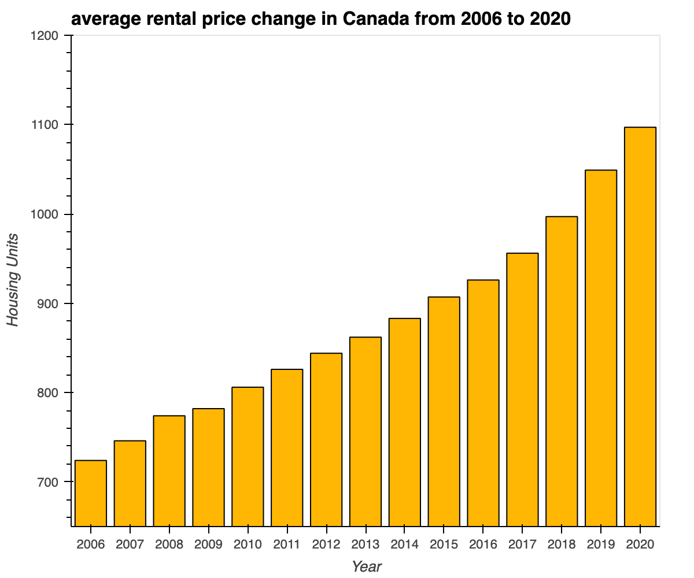

According to the increasing trend in rents, we can get an insight here that many Canadians are postponing buying a home. Instead, they’re choosing to rent. This could mean an increased demand for apartment units and a reduced supply of apartments. Any time apartment demand increases and supply decreases, the cost of rent is going to go up.

### Median Income analysis

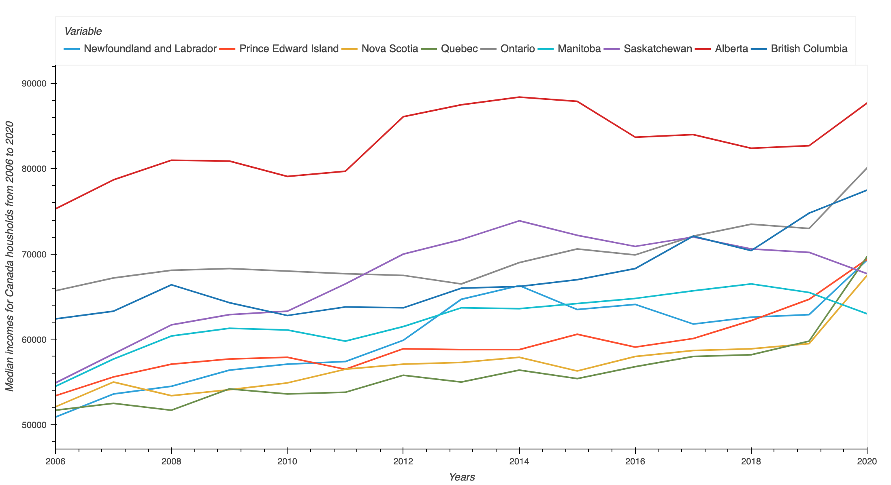

Average Canadian Salary in September 2022 is deduced from Labour Force Survey as $59,300 per year.According to 2020 income survey results, Canadians earned income ranges between 50K-80K per year. If this is compared to the current rental market, Every household is almost spending 30% to 40% of their income on rental and leasing purposes. Among populous Canadian provinces, Alberta had the highest average and median income of $82700 and $87700.Toronto and Calgary can be ranked as having the highest and second-highest income inequality, while Quebec and Atlantic Canada are regions with the highest income equality.

## Should you Buy or Rent Within the Canadian Market?

What Is the Price-to-Rent Ratio?

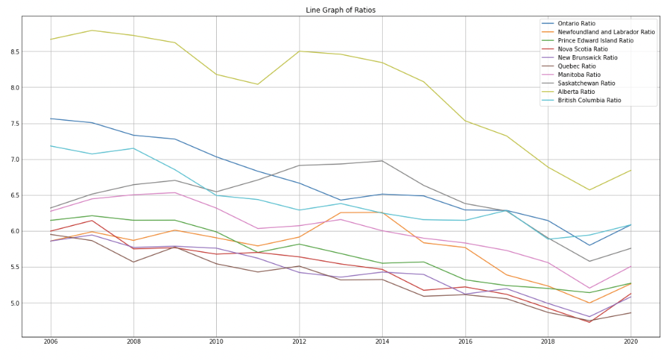 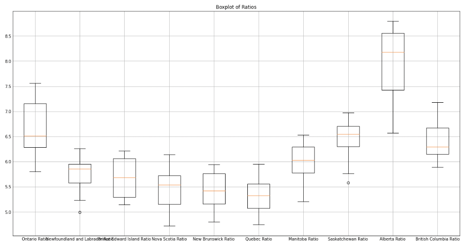

The price-to-rent ratio is the ratio of home prices to annualized rent in a given location. This ratio is used as a benchmark for estimating whether it's cheaper to rent or own property. The price-to-rent ratio is used as an indicator for whether housing markets are fairly valued, or in a bubble. Price to Rent ratio is one of the important factors that could be used by an individual to make decisions.

## Geoview dashboard

Graphically Representing Owned vs Rented Property in 2021
---------------------------------------------------------

The graph below shows the percentage of people that live in a house that
they own in comparison to the percentage of people that live in a rented
property. This percentage has been decreasing ever-so-slightly over the
last census data as housing becomes more unaffordable for people to
purchase adding on to our thesis.

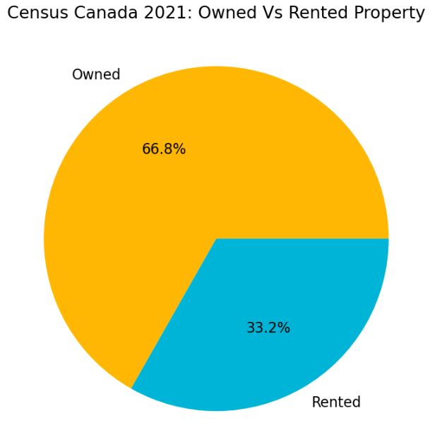

What are Some Key Factors that Could Make Housing Affordable?
----------------------------------------------------------------

The Canadian government took regulatory measures by banning
international investment in housing within Canada but this is definitely
not enough as international investments only contribute to 2% of total
real-estate bought in Canada. But we think that there are a few key
factors that could make housing affordable and some of the leading
factors that we considered included investments in proptech and new
housing developments in Canada and statistics showcased through these
are very promising. As the PropTech industry is relatively new
especially in Canada, there has been a recent surge in investment dating
from 2018 all the way to 2022. With initial investment in mature
companies through private equity but later represented by early stage
investments in startups in 2021 and 2022. These startups include
companies such as Pine, Properly, and Addy that increase affordability
through alternative payment options, or decreases transaction costs, or
introduces easier split ownership of property. On the other hand, new
housing developed in Canada will increase the supply of housing to
hopefully reduce prices further. New developments have been stagnant
from 2002 to 2006 but took a dip from 2007-2009 during the recessionary
period and have been slowly increasing every since. From 2020-2021, new
developments increased by 25% and are expected to maintain that level in
2022.

Investments Within the PropTech Industry In Canada
--------------------------------------------------

The graph below shows how much money proptech companies in Canada have
raised over the years to relate back to how these companies can help to
combat the effect of increasing housing prices within Canada. The
stacked bar chart also shows the stage in which these companies are,
with a majority of these companies being in their early stage of their
business cycles with growth in private equity investment in late stage
companies as well. A lot of these companies focus on increasing
affordability to first-time homebuyers through alternative mortgage
solutions, diverse equity offerings, and lower transaction costs with
ease of purchasing/renting real-estate. PropTech investment has
increased drastically largely due to the increase in housing prices. We
see a lot of companies with new developments within the space. Compiled
data from PropTech Collective Canada also show that there was a surge of
new startups from 2015-2016 within this space, with an increase of over
32% in new companies in the PropTech industry. These companies are in
their midstage currently, seeking late stage venture capital money or
becoming established to IPO over the next couple years. In fact, 78% of
Canadian PropTech companies were founded over the last decade but yet
71% of them are still in their seed stage. As a result, there is still a
huge investment opportunity within the PropTech industry, to capitalize
on how unaffordable housing in Canada has become and provide aid to help
with these investments.

The nearing recession, increasing rates, and the big impact in growth
companies, brought down valuations but also removed a lot of capital
from venture capital and private equity firms to make new investments.
Due to this, investments in PropTech companies declined from 2021-2022
but these investments were still significantly more than the years
2019-2020.

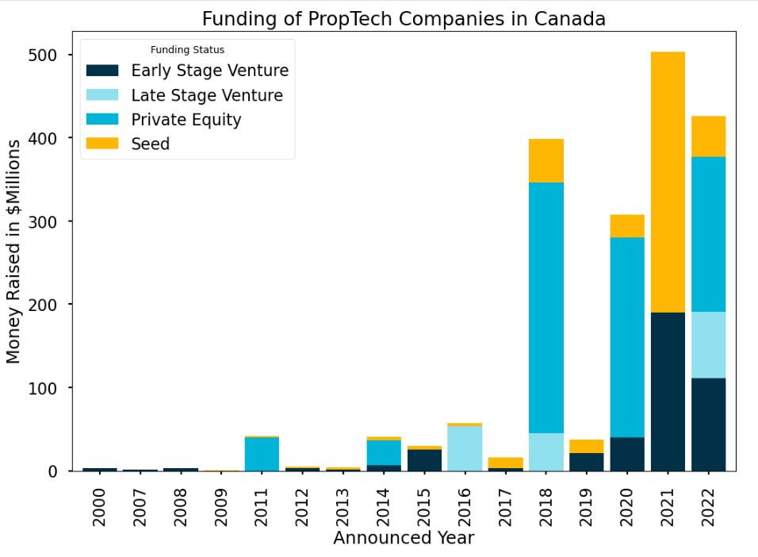

Graphically Representing New Houses Developed Per Quarter Over the Last 20 Years
--------------------------------------------------------------------------------

This graph below shows new houses that have been developed over time.
From 2002-2007, we can see a constant amount of new houses build within
Canada but as we go through recessionary times in 2008 and 2009, new
developments decrease drastically. From 2010-2020, housing developments
are constant around 175,000 new houses per year. The Canadian economy
and government did anticipate a rise in housing prices and were expected
to increase development further in 2020. This however, did not occur due
to the global pandemic, reducing the priority of municipal governments
to focus on housing over the response to the pandemic. But housing
development did increase even further with a 25% increase in new
developments from 2020 to 2021. 2022 is expected to produce slightly
lower amount of housing than 2021 but still significantly more than the
years prior to 2021.

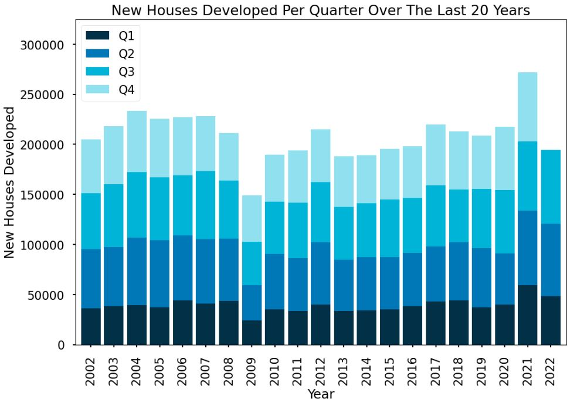

